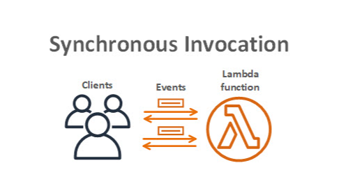
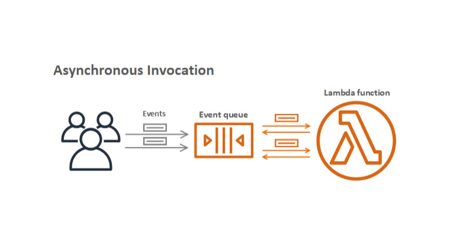
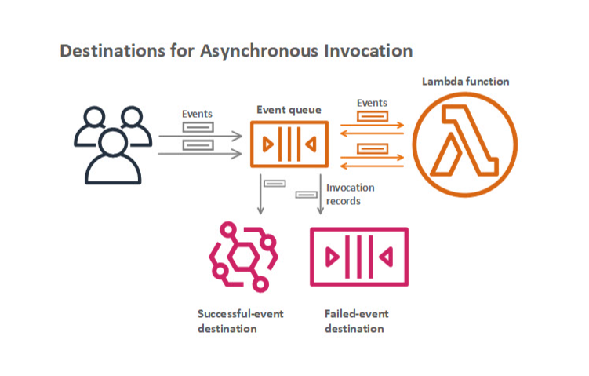
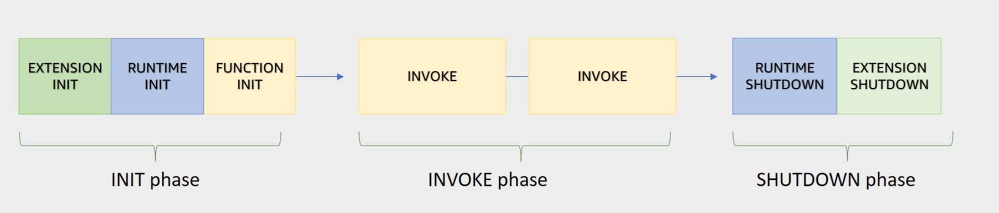

**Invocation Models for Running Lambda Functions**

AWS Lambda can be invoked in three primary invocation models, each suited for different application needs and event sources:

- **Synchronous Invocation**
  

  - **Description**: Executes the function and waits for a response immediately.
  - **Use Cases**: Ideal for applications requiring immediate feedback, such as API Gateway endpoints.
  - **Error Handling**: No built-in retries; retry logic must be managed in the application.
  - **AWS Services**: Amazon API Gateway, Amazon Cognito, AWS CloudFormation, Amazon Alexa, Amazon Lex, Amazon CloudFront.

- **Asynchronous Invocation**
  
  

  - **Description**: Queues events for processing without waiting for completion.
  - **Use Cases**: Suitable for scenarios where immediate response isn't necessary, like file uploads to S3.
  - **Destinations**: Utilizes destinations to route records to other services (e.g., EventBridge, SQS).
  - **AWS Services**: Amazon SNS, Amazon S3, Amazon EventBridge.

- **Polling Invocation**

  - **Description**: Intended for streaming and queuing-based services; Lambda polls these services for events.
  - **Use Cases**: Supports integration with services like Amazon Kinesis, SQS, and DynamoDB Streams.
  - **Event Source Mapping**: Configures event sources to trigger Lambda functions and grants IAM permissions.
  - **AWS Services**: Amazon DynamoDB, Amazon Kinesis, Amazon MQ, Amazon MSK, self-managed Apache Kafka, Amazon SQS.

**Invocation Model Error Behavior**

- **Synchronous**: No built-in retries; retries must be handled in the application logic.
- **Asynchronous**: Built-in retries up to twice for failed invocations.
- **Polling**: Error behavior depends on the event source configuration.

**Lambda Execution Environment**

- **Description**: Secure and isolated environment where Lambda functions execute.
- **Resource Management**: Manages resources required for function execution, including memory and runtime.
- **Extensions**: Supports external extensions that run within the environment.
- **Phases**:
  
  - **Initialization (Init) Phase**: Sets up environment, downloads function code, initializes extensions and runtime.
    - Sub-phases: Extension init, Runtime init, Function init.
  - **Invocation (Invoke) Phase**: Executes the function handler in response to an event.
  - **Shutdown Phase**: Terminates environment after idle period, alerts extensions to stop cleanly.

**Performance Optimization**

- **Serverless Benefits**: Enables high performance through automatic scaling and parallelization.
- **Cold and Warm Starts**:
  - **Cold Start**: Occurs when a new execution environment is set up.
  - **Warm Start**: Reuses existing execution environment, reducing latency.
- **Best Practices**:
  - **Minimize Cold Start Times**: Optimize function code and use provisioned concurrency for predictable performance.
  - **Write Functions for Warm Starts**: Store dependencies locally, limit variable re-initialization, manage connections effectively.
